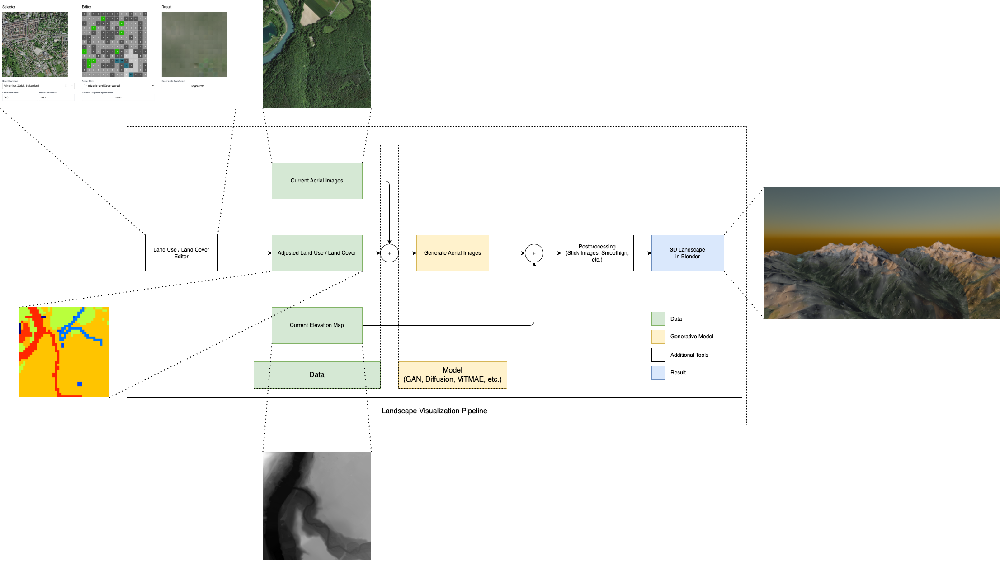

# Visualization of Landscape Changes using Synthesized Aerial Imagery





## Abstract

Land use and land cover (LULC) are in constant flux, driven by both planned interventions and unplanned
dynamics. While research and planning institutions actively analyze and project landscape transformations, effectively communicating these changes to non-expert stakeholders remains a challenge.
This project addresses this gap by developing a system to synthesize aerial imagery directly from LULC
data, enabling intuitive visualization of landscape scenarios. Within the project different synthesizing
methods are examined and implemented. This includes a Generative Adversarial Network (GAN), a
diffusion based U-NET, and a Masked Auto Encoder (MAE).
The synthesized imagery is integrated with existing or modified elevation maps to generate realistic
3D scenes, offering a tangible representation of potential or projected land changes. Additionally, the
system provides interactive tooling for manual adjustments to LULC maps, empowering users to explore
alternative configurations.
The results demonstrate the feasibility of this approach, though further refinement, including enlarged
training datasets and computational resources are required to improve image realism. Future work will
expand the capabilities of the system by incorporating anthropogenic elements, such as buildings and
infrastructure, to better reflect the interaction between natural and human-made environments. This tool
aims to bridge the communication divide between technical experts and broader audiences, supporting
participatory planning, policy development, and public participation in sustainable land management.

## Repository Strcture

The repository is split into three sections.

```
/code
    /editor
    /inference
    /pix2pix
    /unet
    /vitmae
/data
    /dataset
    /source
/docs
```

The **Code** folder contains all tools and model implemented as part of this project.
Folder **Data** contains the script to download and create the datasets.
**Docs** includes the pdf version of the project report as well as the interim and final presentation.

## Prerequisits

1. Install the `uv` package and project manger
```bash
$ pip install uv
```
2. Run `uv sync` to ensure the correct python version and dependencies are downloaded

## Download Dataset

1. Open the `data/01_downloader.ipynb` notebook
   1. Run all cells, this will make sure that the elevation maps and the base aerial images are downloaded and copied to the correct folder
2. Open the `data/02_lulc-extraction.ipynb` notebook
   1. Run all cells, this will make sure that the LULC segmentations are extracted and saved in a separate folder.
   2. Set the `SAVE_AS_AS17` to `True` if you want to only save the `AS17` classes instead of the `AS72`
3. Uset the `data/03_inspect.ipynb` notebook to inspect the downloaded files and to make sure that a corresponding LUCL tile and an alti tile exist for each base image.
